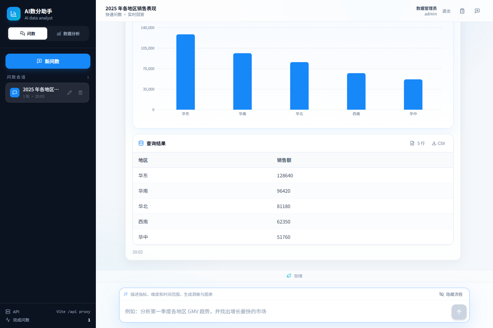
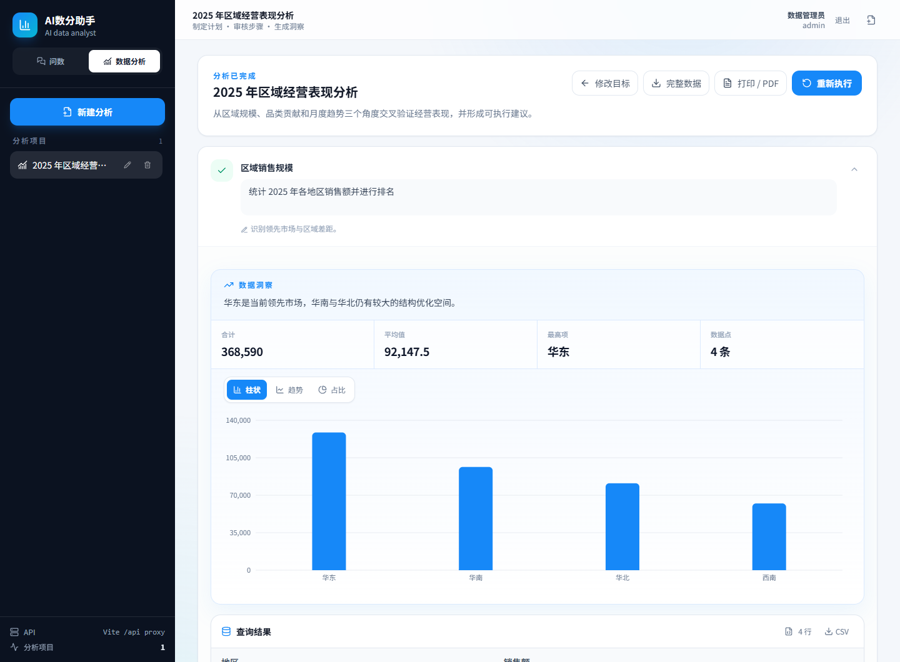
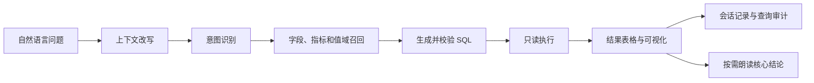
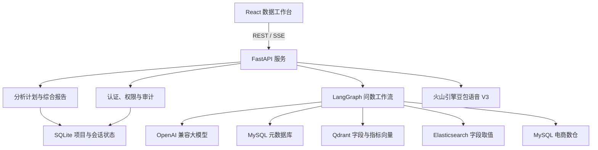

<div align="center">
  <h1>📊 AI 数分助手</h1>
  <p><strong>从自然语言问数，到可审核的数据分析与可视化报告</strong></p>
  <p>面向电商经营场景的智能数据工作台，让业务人员直接与数仓对话，让复杂分析按照计划可靠执行。</p>
</div>

<div align="center">
  
  
  
  
  
  
  
  <a href="https://github.com/mjj90200-glitch/shoper-agent/actions/workflows/ci.yml"></a>
  <br><br>
  <a href="#product-preview">产品预览</a> ·
  <a href="#core-capabilities">核心能力</a> ·
  <a href="#system-architecture">系统架构</a> ·
  <a href="#deployment">部署与启动</a> ·
  <a href="测试.md">测试验收</a>
</div>

---

AI 数分助手采用前后端分离架构，以受控的元数据检索、SQL 安全校验、用户权限和结果审计保证查询过程可解释、可追踪。当前版本将高频即时查询与复杂分析任务拆分为两个独立工作区，同时保持一致的会话体验和实时执行反馈。

| 💬 自然语言问数 | 📈 计划式数据分析 | 🔊 结论语音 | 🧭 全链路可追踪 | 🛡️ 数据安全治理 |
| :---: | :---: | :---: | :---: | :---: |
| 多轮追问、表格与图表 | 先审核计划，再分步执行 | 按需朗读核心结论 | SSE 节点、SQL 与审计记录 | 账号隔离、行级权限与脱敏 |

<a id="product-preview"></a>

## 🖥️ 产品预览

### 快速问数工作区

一句话描述指标、维度和时间范围，系统完成语义理解、元数据召回、SQL 校验与只读执行，并返回数据洞察、可视化和明细结果。会话列表保留每次问数上下文，完整流程图可按需隐藏；查询完成后可以点击“朗读结论”，只播放关键结果，不播报执行过程。



### 数据分析工作区

面向需要多轮查询才能回答的经营问题。系统先生成分析计划供用户审核，再逐步执行查询、组织图表，最终汇总关键发现、行动建议和数据限制。



> 截图中的经营数据为界面展示数据；实际查询结果以接入数仓和当前账号的数据权限为准。

<a id="core-capabilities"></a>

## ✨ 核心能力

### 问数工作区

- 使用自然语言查询销售额、销量、订单数、客单价等经营指标。
- 支持地区、省份、商品、品类、品牌、会员等级、性别和日期等分析维度。
- 支持同一会话内的多轮追问、地区切换、时间切换、指标切换和维度拆解。
- 实时展示问题改写、意图识别、元数据召回、SQL 生成、校验和执行进度。
- 返回查询结果表格、数据摘要以及柱状图、趋势图和占比图。
- 支持会话新建、切换、重命名、删除和历史恢复。
- 支持隐藏完整流程图，仅保留轻量的实时节点状态。
- 支持单次结果 CSV 下载和用户反馈。
- 支持按需朗读问数结论，不播报流程节点、SQL 或完整表格。

### 数据分析工作区

- 根据业务目标生成 2～5 个可审核的分析步骤。
- 执行前可以修改标题与问题、增加步骤或删除步骤。
- 用户确认后才会按顺序查询当前数仓。
- 每个步骤独立保留实时进度、SQL、结果、洞察和图表。
- 失败步骤可以单独重试或跳过，分析任务也可以主动停止。
- 所有步骤完成后生成跨步骤综合报告，包括关键发现、行动建议和数据限制。
- 支持分析项目新建、重命名、删除、刷新恢复和账号级持久化。
- 支持完整数据 CSV 导出，以及打印或另存为 PDF。

### 安全与治理

- 所有业务查询均经过身份认证。
- 会话、审计和分析项目按账号隔离。
- 支持管理员、区域经理和经营分析员三类数据权限。
- 区域经理只能查询授权地区；敏感客户字段按角色禁止查询或脱敏。
- SQL 仅允许 `SELECT` 或 `WITH ... SELECT`，拒绝多语句、注释和数据写入。
- 自动补充外层查询行数限制，避免无边界结果集。
- 保存查询 SQL、执行状态、耗时和反馈，不在审计库中重复保存完整业务结果。
- 登录失效统一返回登录页，避免失效请求继续执行。

## 🔄 产品流程

### 快速问数



### 数据分析


<a id="system-architecture"></a>

## 🏗️ 系统架构



系统中的数据分工：

| 存储 | 用途 |
| --- | --- |
| MySQL `dw` | 电商事实表和维度表，承载真实查询结果 |
| MySQL `meta` | 表、字段、指标及关联关系等权威元数据 |
| Qdrant | 字段和指标的语义向量检索 |
| Elasticsearch | 字段真实取值的全文检索 |
| SQLite | 登录会话、问数审计、会话列表和数据分析项目状态 |

## 🧰 技术栈

| 层级 | 技术 | 主要职责 |
| --- | --- | --- |
| 前端 | React 19、TypeScript、Vite、Tailwind CSS | 双工作区界面、SSE 消费、项目与会话交互 |
| 可视化 | Recharts | 柱状图、趋势图、占比图和指标切换 |
| API | FastAPI、Pydantic | 认证接口、流式问数、会话、审计和分析项目接口 |
| 智能体 | LangGraph、LangChain | 多阶段检索、推理、SQL 生成和结果分析 |
| 业务数据 | MySQL 8、SQLAlchemy | 星型电商数仓、元数据和异步查询 |
| 检索 | Qdrant、Elasticsearch、TEI | 语义召回、全文检索和中文 Embedding |
| 语音 | 火山引擎豆包语音 V3、HTMLAudioElement | 结论合成、播放、暂停、继续和停止 |
| 应用状态 | SQLite | 检查点、审计、会话和分析项目持久化 |
| 工程工具 | Docker Compose、uv、pnpm | 基础服务和依赖管理 |

## 📂 项目结构

```text
shopkeeper-agent/
├── app/
│   ├── agent/                 # LangGraph 图、状态、上下文、节点和结果分析
│   ├── api/
│   │   ├── routers/           # 认证、问数、会话、审计和数据分析接口
│   │   └── schemas/           # API 请求与响应模型
│   ├── audit/                 # 查询审计、反馈和会话持久化
│   ├── auth/                  # 本地身份认证与数据权限策略
│   ├── clients/               # MySQL、Qdrant、ES 和 Embedding 客户端
│   ├── conf/                  # 配置读取与类型定义
│   ├── repositories/          # 数仓、元数据、向量和全文索引访问层
│   ├── scripts/               # 元数据知识库构建与接口评测
│   └── services/              # 问数、分析计划、分析项目和 TTS 服务
├── conf/                      # 应用、元数据和本地认证配置
├── data/                      # SQLite 检查点及应用状态
├── docker/                    # 基础服务编排、初始化 SQL 和模型目录
├── evals/                     # 问数回归评测集
├── frontend/                  # React 前端应用
├── logs/                      # 本地运行日志
├── prompts/                   # 智能体提示词模板
├── tests/                     # 后端单元与安全测试
├── main.py                    # FastAPI 应用入口
├── start.md                   # Windows 日常启动与故障排查
└── 测试.md                    # 完整测试需求和验收标准
```

## 🗃️ 数据范围

当前数据域为电商销售数仓：

- `fact_order`：订单事实数据。
- `dim_date`：日期维度。
- `dim_region`：地区和省份维度。
- `dim_product`：商品、品牌和品类维度。
- `dim_customer`：客户、会员等级和性别维度。

当前版本适合销售额、销量、订单、商品结构、地区贡献、客户分层和时间趋势分析。库存、成本、利润、广告、流量、竞品和外部市场信息不在当前数仓范围内，系统不应为这些主题编造查询结果。

> 当前初始化数据中存在两个名称相同的“华东”地区记录。按地区分组时可能出现两条“华东”，这是已识别的数据质量问题，不是前端重复渲染。正式使用前应完成地区主数据治理。

<a id="deployment"></a>

## 🚀 部署与启动

### 环境要求

- Windows 10/11
- Docker Desktop 与 Docker Compose
- Python 3.14
- uv
- Node.js 20 或更高版本
- pnpm

### 1. 安装依赖

```powershell
uv sync
cd frontend
pnpm install
cd ..
```

### 2. 配置大模型与语音

复制根目录的 `.env.example` 为 `.env`，填入大模型与语音服务密钥：

```dotenv
LLM_API_KEY=your_api_key_here
MYSQL_ROOT_PASSWORD=replace_with_a_local_root_password
MYSQL_USER=shopkeeper
MYSQL_PASSWORD=replace_with_a_local_app_password
MYSQL_HOST=localhost
MYSQL_PORT=3307
VOLCENGINE_TTS_API_KEY=your_volcengine_tts_api_key_here
VOLCENGINE_TTS_VOICE_TYPE=zh_female_vv_uranus_bigtts
```

Docker Compose 和后端共用上述 MySQL 环境变量，仓库不保存真实数据库密码。模型名称、服务地址和语音资源在 `conf/app_config.yaml` 中配置。大模型接入方式兼容 OpenAI Chat API；TTS 使用火山引擎 V3 单向流式接口。语音密钥仅由后端读取，禁止放入 `frontend/.env` 或任何 `VITE_*` 变量。

### 3. 准备 Embedding 模型

```powershell
uv run hf download BAAI/bge-large-zh-v1.5 --local-dir docker/embedding/bge-large-zh-v1.5
```

模型已经存在时无需重复下载。

### 4. 启动基础服务

```powershell
docker compose -f docker/docker-compose.yaml up -d
docker compose -f docker/docker-compose.yaml ps
```

默认端口：

| 服务 | 本机端口 |
| --- | --- |
| MySQL | `3307` |
| Elasticsearch | `9200` |
| Kibana | `5601` |
| Qdrant HTTP / gRPC | `6333` / `6334` |
| Embedding | `8086` |

MySQL 首次启动时会自动导入 `docker/mysql/meta.sql` 和 `docker/mysql/dw.sql`。只有元数据或数仓结构发生变化时才需要重新构建知识库。

### 5. 构建元数据知识库

首次部署或元数据变更后执行：

```powershell
$env:NO_PROXY = "localhost,127.0.0.1"
uv run python -m app.scripts.build_meta_knowledge -c conf/meta_config.yaml
```

不要在未清理旧元数据的情况下重复执行初始化脚本，否则可能产生主键冲突。

### 6. 启动后端

```powershell
$env:NO_PROXY = "localhost,127.0.0.1"
$env:PYTHONUTF8 = "1"
uv run fastapi dev main.py
```

后端接口文档：<http://127.0.0.1:8000/docs>

如果 Windows 控制台编码导致开发命令退出，可以直接启动 Uvicorn：

```powershell
$env:NO_PROXY = "localhost,127.0.0.1"
$env:PYTHONUTF8 = "1"
.\.venv\Scripts\uvicorn.exe main:app --host 127.0.0.1 --port 8000
```

### 7. 启动前端

```powershell
cd frontend
pnpm dev
```

访问地址：<http://127.0.0.1:5173/>

Vite 默认把 `/api` 转发到 `http://127.0.0.1:8000`。需要调整时在 `frontend/.env` 中配置：

```dotenv
VITE_API_BASE_URL=
VITE_DEV_PROXY_TARGET=http://127.0.0.1:8000
```

更完整的日常启动和故障排查说明见 [start.md](start.md)。

## 🔐 本地账号与权限

当前仓库提供三类本地开发账号：

| 账号 | 密码 | 角色与数据范围 |
| --- | --- | --- |
| `admin` | `admin123` | 管理员，全部地区与字段 |
| `east_manager` | `east123` | 华东区域经理，仅华东数据，客户姓名脱敏 |
| `analyst` | `analyst123` | 经营分析员，全地区汇总，客户姓名脱敏 |

本地令牌默认有效期为 480 分钟。生产部署时应替换为企业身份服务，并将签名密钥移出仓库配置。

## 🔌 API 概览

除登录外，所有接口都需要 `Authorization: Bearer <access_token>`。

| 方法 | 路径 | 用途 |
| --- | --- | --- |
| POST | `/api/auth/login` | 登录并获取访问令牌 |
| POST | `/api/query` | 通过 SSE 执行自然语言问数 |
| POST | `/api/tts/synthesize` | 将问数核心结论合成为 MP3 |
| GET | `/api/sessions` | 获取当前用户会话列表 |
| PATCH | `/api/sessions/{session_id}` | 重命名会话 |
| GET | `/api/sessions/{session_id}` | 获取会话查询记录 |
| DELETE | `/api/sessions/{session_id}` | 删除会话 |
| GET | `/api/audits/me` | 获取当前用户查询审计 |
| PUT | `/api/audits/{audit_id}/feedback` | 提交查询反馈 |
| GET | `/api/audits/quality-summary` | 管理员查看质量汇总 |
| POST | `/api/analysis/plan` | 根据目标生成分析计划 |
| POST | `/api/analysis/summary` | 汇总步骤结果并生成综合报告 |
| GET | `/api/analysis/projects` | 获取当前用户分析项目 |
| PUT | `/api/analysis/projects/{project_id}` | 新建或更新分析项目 |
| DELETE | `/api/analysis/projects/{project_id}` | 删除分析项目 |

### SSE 事件

`/api/query` 按执行过程返回事件：

| 类型 | 用途 |
| --- | --- |
| `progress` | 当前节点与运行状态 |
| `audit_context` | 本次查询的审计编号 |
| `query_context` | 原始问题与上下文改写结果 |
| `sql` | 通过生成流程得到的 SQL |
| `result` | 数仓查询结果 |
| `analysis` | 数据摘要和图表规格 |
| `assistant_message` | 非数据问题的自然语言响应 |
| `error` | 流程错误终态 |

### 结论语音

问数语音采用用户主动触发模式。成功完成的助手回复下方会显示“朗读结论”，优先朗读数据摘要；历史消息缺少摘要时使用最终回复作为兜底。播放控件支持暂停、继续和停止，切换到另一条消息时会自动终止上一段音频。

后端会在合成前清理 Markdown、代码块、链接和不适合播报的符号，并规范化金额、百分比与日期。流程节点、SQL 和完整结果表不会进入语音请求。接口要求登录鉴权，单次文本最多 600 个字符，API Key 仅由后端读取。

> 点击朗读会把当前结论文本发送到配置的火山引擎语音服务。接入真实业务数据前，应根据组织的数据处理要求完成用户告知、传输加密、供应商评估和日志脱敏；对不允许外发的数据不要启用云端语音。

## ✅ 测试与质量

安装完后端和前端依赖后，可以在项目根目录执行统一质量门禁：

```powershell
uv run python -m app.scripts.quality_check
```

该命令依次执行 Ruff、全部后端单元测试以及前端 TypeScript 检查和生产构建。GitHub Actions 会在每次推送到 `main` 或创建 Pull Request 时执行同样的检查。

运行后端测试：

```powershell
$env:PYTHONUTF8 = "1"
uv run python -m unittest discover -s tests -v
```

运行前端类型检查与生产构建：

```powershell
cd frontend
pnpm build
```

后端启动后可以运行问数评测集：

```powershell
uv run python -m app.scripts.evaluate_query_api --base-url http://127.0.0.1:8000
```

完整的功能、权限、异常、兼容性和验收要求见 [测试.md](测试.md)。TTS 本轮开发与验证细节见 [9.09 开发日志](workday/9.09.md) 和 [9.09 测试记录](worktest/9.09.md)。

后续架构、安全、评测和部署工作统一记录在 [工程优化开发计划](docs/superpowers/plans/2026-09-10-engineering-optimization.md)，每日实际变更仍分别写入 `workday/` 和 `worktest/`。

## 🛠️ 运行数据与维护

- `data/langgraph-checkpoints.sqlite` 保存 LangGraph 多轮会话检查点。
- `data/shopkeeper-state.sqlite` 保存问数审计、会话元数据和数据分析项目。
- `logs/` 保存本地运行日志。
- 删除或替换上述 SQLite 文件前应先停止后端并做好备份。
- 修改数仓结构后，需要同步修改元数据配置并重建 MySQL、Qdrant 和 Elasticsearch 中的知识库。

## 🚢 生产部署注意事项

当前配置以本地或受控内网部署为目标。进入生产环境前至少需要完成：

- 接入企业统一身份认证和密钥管理。
- 将应用层权限与数据库行级、列级权限结合。
- 替换配置文件中的本地演示账号和令牌签名密钥。
- 为大模型请求、查询执行和导出增加限流、配额和监控告警。
- 为云端语音增加调用配额、可观测性、隐私告知和敏感结论外发策略。
- 完成地区主数据治理，并建立指标口径版本管理。
- 通过反向代理启用 HTTPS、安全响应头和访问日志。
- 制定应用 SQLite 和数仓数据的备份恢复策略。

## 📄 License

版本变化见 [CHANGELOG.md](CHANGELOG.md)。本仓库按 [MIT License](LICENSE) 提供许可。项目对外发布或分发前，请根据实际组织和产品要求补充品牌、隐私、数据处理及第三方依赖声明。
