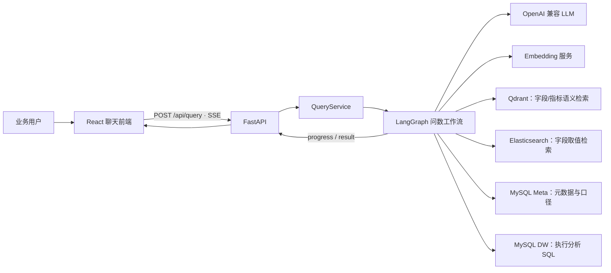
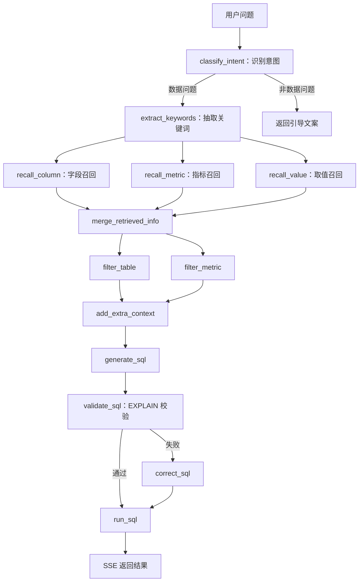

# Day 0：读懂 shopkeeper-agent 项目

这是一份项目导读，目标是在开始开发前建立对业务、架构、代码和当前边界的整体认知。

## 项目目标

项目将电商业务问题转换为数据查询结果。用户输入“统计华北地区的销售总额”一类自然语言问题；系统召回相关表、字段、指标和真实枚举值，生成并执行 SQL，最后将过程和结果流式展示在聊天界面中。

一句话理解：**把“业务问题 → 数据查询 → 分析结果”串成一条可追踪的 AI Agent 链路。**

它不只是让模型直接生成 SQL。SQL 生成前，系统会检索业务元数据与真实字段取值，从而降低表、字段、指标口径和筛选值的幻觉。

## 业务范围

教学数仓模拟了电商分析场景，常见指标包括销售额、GMV、销量、订单数；常见维度包括地区、商品、品类、品牌、会员等级和时间。

建议先查看以下文件，理解数据和指标口径：

- [教学数仓初始化 SQL](/Users/mac/Downloads/shopkeeper-agent-main/docker/mysql/dw.sql)
- [元数据库初始化 SQL](/Users/mac/Downloads/shopkeeper-agent-main/docker/mysql/meta.sql)
- [业务元数据配置](/Users/mac/Downloads/shopkeeper-agent-main/conf/meta_config.yaml)

典型问题：

`统计 2025 年第一季度各大区的 GMV，并按 GMV 从高到低排序`

`查询华东地区 2025 年第一季度销售额最高的前 5 个商品`

`按会员等级统计 2025 年第一季度的订单数和销售额`

## 全局架构



| 组件 | 职责 |
| --- | --- |
| React + Vite | 聊天式界面、执行步骤与结果表格 |
| FastAPI + SSE | 流式 API，将过程和结果实时返回 |
| LangGraph | 编排节点、状态和条件分支 |
| MySQL DW | 存放实际分析数据，执行最终 SQL |
| MySQL Meta | 存放表、字段、指标及关系等权威元数据 |
| Qdrant | 按语义召回相关字段和指标 |
| Elasticsearch | 查找地区、品牌等真实枚举值 |
| TEI / BGE | 将文本向量化，支撑语义检索 |
| LLM | 意图分类、SQL 生成和 SQL 修正 |

## 一次提问如何流转？



整张图定义在 [app/agent/graph.py](/Users/mac/Downloads/shopkeeper-agent-main/app/agent/graph.py)，节点间共享状态定义在 [app/agent/state.py](/Users/mac/Downloads/shopkeeper-agent-main/app/agent/state.py)。

## 目录地图

| 目录 | 主要职责 |
| --- | --- |
| `app/agent/` | LangGraph 图、状态和执行节点，是 Agent 的核心 |
| `app/api/` | FastAPI 路由、依赖注入和请求模型 |
| `app/clients/` | MySQL、ES、Qdrant、Embedding 客户端生命周期 |
| `app/repositories/` | 对各存储系统的访问封装 |
| `app/services/` | 组装运行时依赖、执行图、输出 SSE |
| `app/scripts/` | 构建元数据知识库 |
| `conf/` | 应用和元数据配置 |
| `prompts/` | 各 Agent 节点使用的 Prompt 模板 |
| `docker/` | 本地依赖服务和教学数据初始化 |
| `frontend/src/` | React 页面、SSE 客户端和组件 |

需求定位速查：

| 想做什么 | 优先查看的位置 |
| --- | --- |
| 新增 Agent 步骤 | `app/agent/graph.py`、`app/agent/nodes/`、`state.py` |
| 优化 SQL 生成 | `prompts/generate_sql.prompt`、`generate_sql.py`、`meta_config.yaml` |
| 调整召回效果 | `recall_*.py`、`filter_*.py`、`repositories/` |
| 调整 API | `app/api/`、`app/services/query_service.py` |
| 调整聊天与流式交互 | `frontend/src/App.tsx`、`frontend/src/lib/agentApi.ts` |

## 推荐阅读顺序

1. [README.md](/Users/mac/Downloads/shopkeeper-agent-main/README.md)：目标、技术栈与启动方式。
2. [app/agent/graph.py](/Users/mac/Downloads/shopkeeper-agent-main/app/agent/graph.py)：先看清整个问数链路和分支。
3. [app/agent/state.py](/Users/mac/Downloads/shopkeeper-agent-main/app/agent/state.py)：理解节点之间传递的数据。
4. `app/agent/nodes/`：优先读 `classify_intent.py`、`generate_sql.py`、`validate_sql.py`、`run_sql.py`。
5. [app/services/query_service.py](/Users/mac/Downloads/shopkeeper-agent-main/app/services/query_service.py) 与 `app/api/`：理解 HTTP 请求如何启动图并输出 SSE。
6. [conf/meta_config.yaml](/Users/mac/Downloads/shopkeeper-agent-main/conf/meta_config.yaml)：理解业务元数据如何约束模型。
7. `frontend/src/App.tsx` 和 `frontend/src/lib/agentApi.ts`：理解前端如何发起请求和消费 SSE。
8. 最后阅读 `app/repositories/` 与 `app/clients/`，深入基础设施访问细节。

## 本地运行与最小验证

完整启动说明见 [start.md](/Users/mac/Downloads/shopkeeper-agent-main/start.md)。首次运行需要准备 `.env` 中的 `LLM_API_KEY`，核心命令如下：

```bash
uv sync
docker compose -f docker/docker-compose.yaml up -d
uv run python -m app.scripts.build_meta_knowledge -c conf/meta_config.yaml
uv run fastapi dev main.py --host 0.0.0.0 --port 8000
```

前端另开一个终端：

```bash
cd frontend
pnpm install
pnpm dev --host 0.0.0.0 --port 5173
```

最小 API 验证：

```bash
curl -N -X POST http://127.0.0.1:8000/api/query \
  -H 'Content-Type: application/json' \
  -d '{"query":"统计华北地区的销售总额","session_id":"123e4567-e89b-12d3-a456-426614174000"}'
```

正常情况下，先收到多个 `progress` 事件，最后收到 `result` 事件。

## 当前边界：后续开发的切入点

- 目前是**单轮问数**：每次请求只携带当前 `query`，不能理解“那华北呢？”等追问。
- 当前没有自动化测试目录，主要依赖人工验证。
- `EXPLAIN` 只验证 SQL 可执行性；仍需要只读限制、限行、超时和危险 SQL 拦截。
- 未实现用户、权限、持久化会话和历史会话回看。
- 结果以表格为主，尚未支持自动图表、口径解释和导出。

这些边界不是缺点本身，而是你二次开发并形成简历成果的空间。

## Day 0 完成清单

- [ ] 能用一句话说明项目的业务价值。
- [ ] 能画出“前端 → API → LangGraph → 检索/数仓/LLM”的数据流。
- [ ] 能说清 Qdrant、Elasticsearch、MySQL Meta、MySQL DW 的区别。
- [ ] 能定位数据问题与非数据问题的流程分支。
- [ ] 能启动服务并完成一次自然语言问数。
- [ ] 知道改工作流看 `app/agent/`，改 Prompt 看 `prompts/`，改界面看 `frontend/src/`。

## Day 1 建议

优先实现 P0 多轮会话记忆：使用 `thread_id` 和 LangGraph Checkpointer 管理短期会话，增加追问改写节点，并为同会话追问、跨会话隔离、无历史降级等场景补自动化测试。

相关文档：

- [P0 设计文档](/Users/mac/Downloads/shopkeeper-agent-main/docs/superpowers/specs/2026-08-31-memory-system-design.md)
- [P0 实现计划](/Users/mac/Downloads/shopkeeper-agent-main/docs/superpowers/plans/2026-08-31-memory-system.md)

> 实施 P0 前，先补齐所有下游节点对改写问题的消费，并落实历史截断、会话校验和自动化测试。
