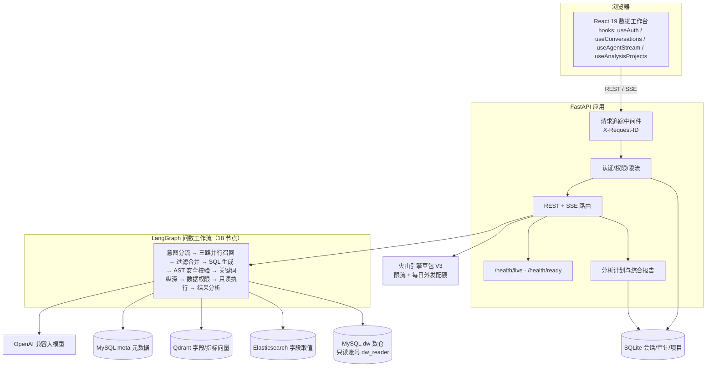
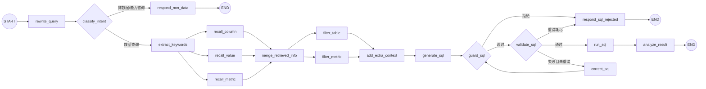
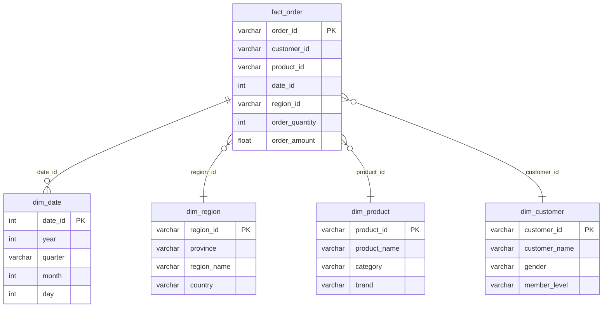
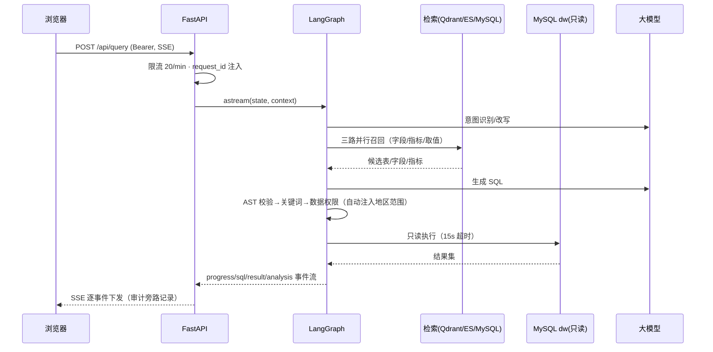

# 架构与设计材料（P4-D）

> 面向技术面试与简历交付的一页式材料。全部图示与代码一一对应，可按图索骥。

## 1. 系统架构

## 2. LangGraph 执行图

多轮记忆由 SQLite Checkpointer 持久化（thread = `username:session_id`）。

## 3. 数仓 ER 图（星型模型）

## 4. 一次问数的时序

## 5. SQL 安全设计（P2）

四层纵深，任何一层拦截即终止：

| 层 | 机制 | 拦截目标 |
| --- | --- | --- |
| 1. AST 结构校验（sqlglot） | 仅单条 SELECT/CTE；白名单 dw 库；拒系统库/写操作/文件/变量/危险函数；JOIN≤6、子查询≤4 | 语法层绕过、越库、资源攻击 |
| 2. 关键词扫描（保留） | 文本黑名单 + 括号/字符串完整性 | 纵深防御 |
| 3. 数据权限（AST 注入） | 区域经理自动包装 `region_name IN (授权地区)`；敏感列按字段标识拒绝 | 越权行/列 |
| 4. 数据库账号 | `dw_reader` 仅 SELECT dw.*，15s 语句超时 | 兜底：应用层全失效也写不了 |

验证：80 场景 85 轮评测含 13 个安全终态用例；`dw_reader` 实测 INSERT/UPDATE/DELETE/CREATE 全部 ERROR 1142。

## 6. 可观测性与质量指标（P3）

- 每请求 `X-Request-ID` 贯穿日志、错误信封与响应头。
- `/health/ready` 聚合五依赖就绪状态（healthy/degraded/unavailable）。
- 审计记录节点耗时（`step_timings`）与稳定错误码（`error_code`）。
- 管理员质量摘要：成功率、成功查询 P50/P95 延迟、按码分类的失败分布、反馈率。

## 7. 工程质量基线（v0.3 阶段）

- 后端 136 测试 / 前端 20 测试全绿；Ruff；tsc + Vite 构建；GitHub Actions 双 Job。
- 一条 `docker compose --profile app up -d --build` 启动全栈，已实测端到端问数。
