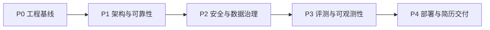
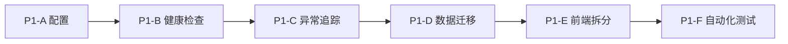
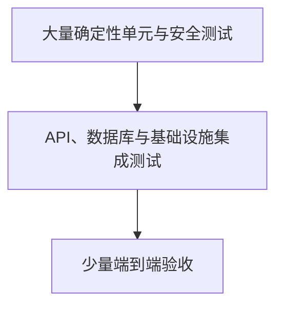

# AI 数分助手工程优化开发计划

> 制定日期：2026-09-10
>
> 当前版本：0.2.0
>
> 计划状态：执行中
>
> 核心目标：停止无边界增加 Web 功能，将项目优化为可复现、可测试、可部署、可观测，并适合写入简历和参与技术面试的软件工程项目。

## 1. 项目定位

项目统一定位为：

> 面向电商数仓的安全、可审计、可追溯的智能问数与经营分析平台。

项目不以“聊天页面”作为主要卖点，而是突出以下工程能力：

- 使用 LangGraph 编排多阶段自然语言问数工作流。
- 使用元数据、Qdrant 和 Elasticsearch 完成字段、指标与字段值召回。
- 对大模型生成的 SQL 进行安全校验、纠错、权限限制和只读执行。
- 支持多轮上下文、Checkpoint、查询审计、反馈和分析任务持久化。
- 支持复杂分析计划、分步执行、结果溯源、图表和语音结论。
- 通过自动化测试与评测集持续度量系统质量。

## 2. 当前工程基线

截至 0.2.0，本机基线如下：

| 项目 | 当前结果 |
| --- | --- |
| 后端静态检查 | Ruff 通过 |
| 后端测试 | 54/54 通过 |
| 前端检查 | TypeScript 与 Vite 生产构建通过 |
| Agent 评测集 | 30 个场景、35 轮请求，当前报告 34/35 通过 |
| 持久化 | LangGraph Checkpoint、会话、审计和分析项目已落地 SQLite |
| Git 仓库 | 已移除本地 workspace 依赖和 304 个 `lxreport` 生成文件 |
| CI | 工作流已建立，等待提交推送后的远程运行验证 |

当前 34/35 的评测结果只能说明现有规则检查通过率，不能直接宣传为真实业务准确率。后续必须补充结果正确性和人工标注评测。

## 3. 开发原则

1. 先保证工程基线，再增加新功能。
2. 每个阶段必须包含设计、实现、测试、文档和验收。
3. 一次只重构一个边界，保持主分支始终可运行。
4. 外部服务全部设置超时，失败必须返回稳定错误结构。
5. 安全能力不能只依赖 Prompt，必须在应用和数据库层重复校验。
6. 简历只填写已经实测的数据，不使用计划目标冒充实现结果。
7. 每次开发更新 `workday/日期.md`，测试要求更新 `worktest/日期.md`。

## 4. 总体路线

| 阶段 | 状态 | 核心结果 |
| --- | --- | --- |
| P0 工程基线 | 本机完成 | 锁文件、仓库清理、环境变量、统一质量命令、CI |
| P1 架构与可靠性 | 下一阶段 | 配置校验、健康检查、统一异常、迁移、前端拆分 |
| P2 安全与数据治理 | 未开始 | SQL AST、只读账号、权限增强、限流与隐私策略 |
| P3 评测与可观测性 | 未开始 | 质量指标、链路追踪、成本延迟和自动回归 |
| P4 部署与简历交付 | 未开始 | 完整容器化、演示环境、架构材料和版本发布 |

## 5. P0：工程基线治理

### 5.1 已完成

- 修复无效 uv workspace，重新生成锁文件。
- 验证 `uv sync --frozen`。
- 将 MySQL 运行凭据改为环境变量。
- 从 Git 移除 `lxreport` 生成文件和依赖目录，本机材料保留。
- 增加统一质量检查入口。
- 增加 GitHub Actions 后端和前端任务。
- 增加 pre-commit 基础仓库检查。
- 建立 Changelog，并将项目版本更新为 0.2.0。

### 5.2 提交后补充验收

- 在 GitHub 验证 backend 和 frontend 两个 CI Job。
- 在全新克隆目录执行一次 README 安装流程。
- CI 通过后创建 `v0.2.0` 标签和 Release；该动作需要单独确认。

## 6. P1：架构与可靠性

P1 是下一阶段，目标是在不改变已有产品行为的前提下，让系统边界清晰、启动失败可诊断、错误可追踪、数据结构可演进。

### P1-A 配置校验与启动诊断

开发内容：

- 将当前配置加载收敛为单一 Settings 入口。
- 区分开发、测试和生产环境。
- 启动时校验必填变量、URL、端口、超时和数值范围。
- 错误信息只显示缺失变量名，不输出密钥值。
- 避免模块 import 时立即创建难以替换的全局配置。
- 为测试提供显式配置覆盖方式。

验收标准：

- 缺失 `LLM_API_KEY`、`MYSQL_USER` 或 `MYSQL_PASSWORD` 时快速失败。
- 错误中不出现密钥和密码内容。
- 测试可以不依赖开发者本机 `.env` 运行。
- 现有 54 个测试保持通过，并增加配置边界测试。

### P1-B 健康检查与依赖就绪状态

开发内容：

- 增加 `/health/live`，只判断应用进程是否存活。
- 增加 `/health/ready`，检查 MySQL、Qdrant、Elasticsearch 和 Embedding。
- 返回每项依赖的状态与耗时，不返回连接凭据。
- 区分 `healthy`、`degraded` 和 `unavailable`。
- 为未来 Docker/Kubernetes 健康探针预留稳定契约。

验收标准：

- 单个依赖故障不会导致健康接口自身崩溃。
- 就绪接口有总超时，不能无限等待。
- 健康检查不调用大模型，不产生模型费用。
- 正常、超时和异常场景都有自动化测试。

### P1-C 统一异常和请求追踪

开发内容：

- 定义统一 API 错误结构：`code`、`message`、`request_id`、`details`。
- 建立业务异常、依赖异常、权限异常和系统异常层级。
- 将 request ID 写入响应头和错误响应。
- SSE 使用稳定的错误事件结构，不再直接返回原始异常文本。
- 日志统一包含 request ID、用户、会话和耗时。

验收标准：

- REST 与 SSE 的错误都可以通过 request ID 定位日志。
- 未处理异常不会向前端暴露数据库地址、SQL 驱动信息或密钥。
- 401、403、404、409、422、502、503 行为有契约测试。

### P1-D 数据库迁移与仓储边界

开发内容：

- 为 SQLite 应用状态建立版本化迁移机制。
- 将建表语句从业务服务中移出。
- 拆分会话、审计、反馈、质量统计和分析项目仓储。
- 明确事务边界，避免一个服务同时负责 SQL、状态和统计。
- 增加旧数据库升级和回滚说明。

验收标准：

- 空数据库可以迁移到最新版本。
- 已有数据库可以保留数据升级。
- 重复执行迁移保持幂等。
- 仓储测试使用临时数据库，不操作开发者本地数据。

### P1-E 前端状态与组件拆分

开发内容：

- 将 `App.tsx` 中的认证、会话、SSE 和工作区状态拆分。
- 提取 `useAuth`、`useSessions` 和 `useAgentStream`。
- 使用 reducer 表达消息流转状态，减少分散布尔变量。
- 快速问数和数据分析形成独立工作区容器。
- 增加页面级 Error Boundary 和统一 API 错误展示。

验收标准：

- `App.tsx` 只保留应用外壳和顶层组合，目标控制在约 250 行以内。
- 取消请求、登录失效、SSE 错误和切换会话逻辑可独立测试。
- UI 行为与当前版本保持一致。
- 前端生产构建继续通过。

### P1-F 前端与 API 自动化测试起步

开发内容：

- 引入前端组件测试框架。
- 覆盖登录、会话、新建查询、SSE 完成和错误状态。
- 增加最小 API 契约测试。
- CI 输出可读的测试结果。

验收标准：

- 核心状态逻辑不再只能依赖人工点击验证。
- 前端至少覆盖正常请求、取消、401 和 SSE 错误四类路径。

### P1 推荐执行顺序

第一项具体开发任务为 **P1-A 配置校验与启动诊断**。

## 7. P2：安全与数据治理

### P2-A SQL AST 安全校验

- 使用 SQL AST 解析替代自定义关键词扫描作为主要判定依据。
- 只允许 SELECT 和合法 CTE。
- 建立数据库、表、字段和函数白名单。
- 拒绝系统库、文件操作、变量、写操作和多语句。
- 限制 JOIN 数量、子查询深度和最大返回行数。
- 保留现有防护作为纵深防御，而不是直接删除。

### P2-B 数据库最小权限

- 为数仓建立独立只读账号。
- 元数据库构建账号与在线查询账号分离。
- 配置数据库侧执行超时和连接池上限。
- 验证即使应用护栏失效，数据库账号也无法执行写操作。

### P2-C 行列权限升级

- 将地区权限从正则匹配升级为 AST 条件注入或数据库安全视图。
- 支持多地区、`IN`、CTE 和别名场景。
- 列权限使用字段标识而不是展示名匹配。
- 查询前限制、查询后脱敏两层同时保留。

### P2-D 认证、限流和外发治理

- 将演示认证与生产认证适配器分离。
- 登录、问数、分析和 TTS 分别设置限流策略。
- TTS 增加字符配额和敏感内容外发检查。
- 日志、审计和导出文件执行脱敏。
- 建立密钥轮换与泄露应急说明。

### P2 验收指标

- 安全测试中的写操作和越权访问拦截率为 100%。
- 应用数据库账号不具备 INSERT、UPDATE、DELETE、DDL 权限。
- Prompt 注入不能绕过表、列、地区和只读限制。
- TTS 不会在未授权时向云端发送敏感结论。

## 8. P3：评测与可观测性

### P3-A 评测集升级

- 从 30 个场景扩充至至少 80 个，目标达到 100 个稳定回归场景。
- 增加模糊表达、多轮指代、空结果、错误指标、越权请求和 Prompt 注入。
- 从 `sql_contains` 升级为 SQL 执行结果和业务口径断言。
- 对开放式报告引入规则检查与人工评分抽样。
- 每个报告记录数据版本、Prompt 版本和模型版本。

### P3-B 质量指标

持续统计：

- SQL 执行正确率。
- 非数据问题识别准确率。
- 越权请求拦截率。
- 查询成功率。
- P50、P95 延迟。
- 平均 Token 用量和单次调用成本。
- 用户正向反馈率。

### P3-C 可观测性

- 对请求、LangGraph 节点、检索、LLM、SQL 和 TTS 建立统一链路标识。
- 记录各节点耗时、候选召回数量和重试次数。
- 增加结构化日志和基础指标端点。
- 区分业务拒答、模型失败、检索失败、SQL 失败和外部依赖失败。
- 建立慢查询和高失败率告警规则说明。

### P3 验收标准

- 每次 Prompt、模型或检索策略变更均能生成可比较报告。
- CI 执行不依赖真实付费模型的确定性测试。
- 真实模型评测作为受控任务运行，并记录成本。
- README 只展示有报告文件支持的真实指标。

## 9. P4：部署与简历交付

### P4-A 应用容器化

- 增加后端和前端 Dockerfile。
- Compose 同时编排应用和基础设施。
- 增加健康检查、启动依赖和资源限制。
- 提供开发与演示配置，避免每次启动全部高消耗组件。

### P4-B 轻量演示模式

- 提供不依赖完整检索基础设施的可选演示模式。
- 使用固定演示数据和明确的功能降级提示。
- 保证低性能设备也能展示登录、问数流程、图表和审计能力。
- 演示模式不得伪装成真实生产结果。

### P4-C 发布与运维材料

- 建立版本标签和 GitHub Release。
- 提供初始化、备份、恢复、升级和故障排查文档。
- 增加部署环境变量清单。
- 增加依赖许可证与第三方服务说明。

### P4-D 简历与面试材料

- 系统架构图。
- LangGraph 执行图。
- 数据库 ER 图。
- 一次查询的时序图。
- SQL 安全设计说明。
- Agent 评测报告。
- 3 分钟功能演示视频或在线演示地址。
- STAR 项目讲解稿和可量化简历描述。

### P4 验收标准

- 新用户可以仅依赖 README 完成启动。
- 完整环境可以通过一条 Compose 命令启动。
- GitHub 主分支 CI 为绿色。
- Release 包含版本说明、已知限制和验证结果。
- 简历中的每个数字都能定位到测试或评测报告。

## 10. 测试策略

| 层级 | 主要范围 | 是否进入常规 CI |
| --- | --- | --- |
| 单元测试 | SQL、权限、状态机、文本处理、服务逻辑 | 是 |
| API 契约测试 | 状态码、错误结构、鉴权、SSE 事件 | 是 |
| 前端组件测试 | Hooks、reducer、错误和交互状态 | 是 |
| 基础设施集成测试 | MySQL、Qdrant、ES、Embedding | 可拆分为独立 Job |
| 真实模型评测 | 准确率、延迟、Token 和成本 | 手动或定时执行 |
| 浏览器 E2E | 核心用户路径 | 发布前执行 |

每个阶段的 Definition of Done：

- 需求和非目标明确。
- 代码通过 Ruff、后端测试和前端构建。
- 新增行为具有对应自动化测试或明确人工验收步骤。
- README、开发记录和测试记录同步更新。
- 不提交密钥、本地数据库、日志、依赖目录和临时测试响应。
- 提交信息能准确说明一个独立工程变化。

## 11. 简历成果映射

| 工程阶段 | 可形成的简历证据 |
| --- | --- |
| P0 | 冻结依赖、CI、仓库治理、环境变量和版本管理 |
| P1 | 分层架构、健康检查、统一异常、迁移和前端状态管理 |
| P2 | SQL AST、最小权限、行列级权限、限流和隐私治理 |
| P3 | Agent 评测集、准确率、延迟、成本和链路追踪 |
| P4 | 完整部署、演示环境、Release 和技术文档 |

最终简历建议围绕三条主线组织：

1. 复杂 Agent 工作流与多路检索。
2. 大模型生成 SQL 的安全执行与数据治理。
3. 自动测试、评测、可观测性和部署工程。

## 12. 暂不进入范围

在 P1～P4 完成前，暂不优先开发：

- 新的 Web 页面和装饰性交互。
- 音色复刻和复杂语音对话。
- 与当前电商数仓无关的新数据域。
- 多租户计费系统。
- 为展示技术数量而进行的微服务拆分。

如果新需求不能明显提升可靠性、安全性、可评测性或简历证明力，应先进入待办列表，不打断当前工程优化主线。

## 13. 下一步

下一次开发从 **P1-A 配置校验与启动诊断** 开始。开发前先确认设计边界，完成后再进入 P1-B 健康检查，避免配置重构和运行状态接口同时修改导致问题难以定位。
