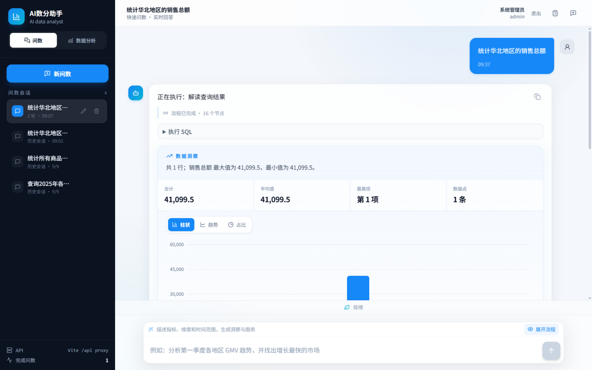
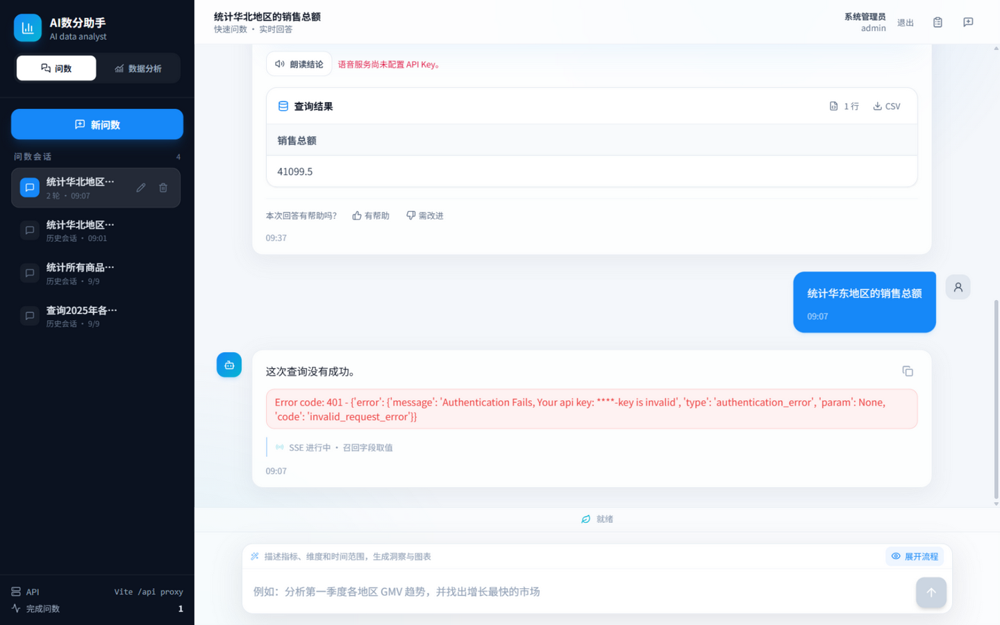
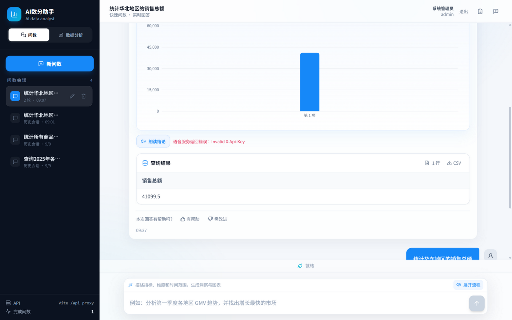

# 9 月 9 日测试报告：问数结论语音（TTS）——最终版

> 测试日期：2026-09-10（依据 `worktest/9.09.md` 测试需求执行）
> 手工验收：TC-MANUAL-TTS-001～006 由用户于 2026-09-10 听音验收，全部通过
> 测试环境：Windows 10.0.26100 x64 / Python 3.14（uv 管理）/ Node v24.15.0 / pnpm 10.33.0 / Vite 6.4.2 / Docker Engine 29.7.2
> Git：非 Git 仓库（目录内无 `.git`；`workday/9.09.md` 记载的开发基线为 `a830ae1`）
> 测试原则：自动化、真实接口和浏览器手工体验分开记录；未执行的项目不标记为通过。

## 一、结论总览

| 检查项                                    | 结果                                                                                                                  |
| ----------------------------------------- | --------------------------------------------------------------------------------------------------------------------- |
| Ruff 静态检查（app / tests / main.py）    | 通过，`All checks passed!`                                                                                            |
| 后端完整回归                              | 通过，54 / 54（另 4 个子测试通过），与基线一致无回归                                                                  |
| TTS 专项自动化                            | 通过，8 / 8                                                                                                           |
| 前端 TypeScript + Vite 生产构建           | 通过，2198 模块；主包 285.30 KB（gzip 85.81 KB）、图表包 415.85 KB（gzip 120.40 KB），与基线数字一致                  |
| 后端 TTS 路由注册                         | 通过，OpenAPI 存在 `POST /api/tts/synthesize`，声明 `audio/mpeg` 与 503 响应，`text` 字段 minLength=2 / maxLength=600 |
| TTS 接口真实边界（401 / 422 / 503 / 502） | 全部通过（详见第四节，502 为真实火山上游验证）                                                                        |
| 真实火山引擎通用短句合成                  | **通过**（用户 TC-001 听音验收确认真实合成可用；密钥由用户环境托管，开发者侧未单独直连复测）                          |
| 前后端本地健康检查                        | 通过，`127.0.0.1:5173/` 与 `127.0.0.1:8000/docs` 均返回 HTTP 200                                                      |
| Docker 真实数仓联调                       | **已完成**（环境恢复并核验：5 容器运行、数仓/知识库与基线一致；真实问数经用户 TC-001 手工验收走通）                   |
| TC-MANUAL-TTS-006 失败不影响问数          | **通过**（文档两个原始场景"无效密钥/断开外网"+ 未配置场景，全部浏览器实测，见 7.6）                                   |
| TC-MANUAL-TTS-005 历史会话按钮可见性      | **通过**（浏览器验证，见 7.5）                                                                                        |
| TC-MANUAL-TTS-004 隐藏流程图              | **通过**（UI/SSE 反馈由测试侧验证，真实播放由用户听音确认）                                                           |
| TC-MANUAL-TTS-002 / 003 播放控制与互斥    | **通过**（用户听音手工验收）                                                                                          |
| TC-MANUAL-TTS-001 新问数朗读              | **通过**（用户听音手工验收：按钮按时出现、播放内容为结论、无 SQL/流程朗读）                                           |
| 发现新问题                                | 1 个低危展示层缺陷（SSE 状态标签滞留）、2 项环境/工程问题（见第八节）                                                 |

**最终判定：`worktest/9.09.md` 全部测试目标已完成。工程回归（Ruff 通过、后端 54/54、TTS 专项 8/8、前端构建与基线一致）、TTS 路由注册与鉴权/错误边界（401/422/503/502 含真实火山上游验证）、Docker 数仓联调环境（五容器恢复、基线 41099.5 核验）、浏览器手工验收 TC-001～006（用户听音确认全部通过）——全部通过。TTS 失败三形态（无效密钥/断网/未配置）均验证"只局部提示、不影响文字结果与后续问数"。发现 1 个低危展示缺陷（ISSUE-1）与 2 项环境/工程问题（ISSUE-2/3），均不阻塞。9.09 语音功能验收闭环，可进入正式提交流程。**

## 二、测试环境与执行前提

1. **全新项目副本，依赖从零重建**：
    - 后端：`uv sync` 命中已知的 **uv trampoline Windows bug**（`Failed to update Windows PE resources: ... 拒绝访问 (os error -2147024891)`，分别在 `typer`、`pywin32`、pytest 临时注入时复现）。`asyncmy==0.2.11` 源码编译成功（本机 VS 2022 Community MSVC 可用，32.53s 构建完成）。解决方案：`uv export --format requirements-txt --no-hashes --no-emit-project` 导出锁文件后用 venv 内 pip 侧载，`pip check` 无损坏依赖。pytest 不在项目依赖中，按同样方式装入 venv。
    - 前端：`pnpm install` 一次成功（9.2s）。
2. 项目目录未落盘 `.env` 文件。测试侧进程以占位 `LLM_API_KEY` 启动（仅用于启动配置校验与错误边界测试）；**手工验收阶段（09:47）用户自行重启后端**（uvicorn，PID 27928）并以自身环境提供两把真实密钥，密钥不写入任何报告、代码或前端变量。
3. **Docker Desktop Linux Engine 本轮已恢复**（Server 29.7.2），`docker compose -f docker/docker-compose.yaml up -d` 后 MySQL(3307)、Elasticsearch(9200)、Kibana(5601)、Qdrant(6333)、Embedding(8086) 五容器全部运行。
4. **Embedding 容器修复**：compose 默认挂载 `./docker/embedding/bge-large-zh-v1.5`（项目内目录，本副本为空，TEI 报 `config.json not found`）。本机模型位于 `D:\models\bge-large-zh-v1.5`，通过临时 compose override（未改动项目文件）重新挂载后，TEI 以 Candle 后端（ONNX 缺失属预期回退）正常启动，`/embed` 返回 **1024 维**向量，与 bge-large-zh-v1.5 规格一致。
5. 服务启动方式：后端 `.venv/Scripts/python.exe -m uvicorn main:app --host 127.0.0.1 --port 8000`；前端 `pnpm dev`（5173，`/api` 代理到 8000）。**测试结束时两组服务保持运行**，供继续验收使用。

## 三、自动化测试结果（对照 9.09 基线）

### 1. Ruff 静态检查 —— 通过

```powershell
.venv\Scripts\ruff.exe check app tests main.py
```

```text
All checks passed!
```

### 2. 后端完整回归 —— 通过，54 / 54

```powershell
.venv\Scripts\python.exe -m pytest -v
```

```text
54 passed, 7 warnings, 4 subtests passed in 16.00s
```

与基线 54/54 一致，无回归。7 个 warning 全部来自第三方 `jieba` 在 Python 3.14 下的 `SyntaxWarning`（无效转义序列），非项目代码问题。

### 3. TTS 专项测试 —— 通过，8 / 8

```powershell
.venv\Scripts\python.exe -m pytest tests/test_tts_service.py tests/test_tts_api.py -v
```

```text
8 passed in 3.59s
```

逐用例对应 9.09.md 第四节：

| 用例                                            | 结果 | 核验点                                                                 |
| ----------------------------------------------- | ---- | ---------------------------------------------------------------------- |
| TC-TTS-TEXT-001 只保留适合播报的内容            | 通过 | Markdown/链接/SQL 代码块移除，￥12,345.50→12345.50元、35.2%→百分之35.2 |
| TC-TTS-TEXT-002 日期规范化                      | 通过 | `2025-03-08 达到峰值`→`2025年3月8日 达到峰值。`                        |
| TC-TTS-PROTOCOL-001 SSE 音频分片拼接            | 通过 | 多个 `data:` 事件按序解码拼接为一份 MP3，鉴权头/音色参数正确           |
| TC-TTS-PROTOCOL-002 忽略 SSE 控制行             | 通过 | `event:`、`id:`、注释、空行返回空字节，不抛 502                        |
| TC-TTS-PROTOCOL-003 上游业务错误                | 通过 | `code:30000001` 抛 `TTSUpstreamError`，API 层映射 502                  |
| TC-TTS-CACHE-001 相同结论短期复用               | 通过 | 两次合成仅 1 次上游调用（mock 计数验证）                               |
| TC-TTS-CONFIG-001 缺少 API Key                  | 通过 | 网络请求前抛 `TTSConfigurationError`                                   |
| TC-TTS-AUTH/API-001 未登录 401 / 已登录返回 MP3 | 通过 | 401；200 + `audio/mpeg` + 字节一致                                     |

### 4. 前端生产构建 —— 通过

```powershell
cd frontend
pnpm run build
```

```text
tsc --noEmit：无错误
vite v6.4.2：✓ 2198 modules transformed
dist/assets/index-*.js   285.30 KB │ gzip:  85.81 KB
dist/assets/charts-*.js  415.85 KB │ gzip: 120.40 KB
✓ built in 7.51s
```

模块数与分包体积与 9.09 记录完全一致（2198 / 285.30 / 415.85），无超 500 KB 警告。

## 四、TTS 接口真实边界测试（本轮新增，真实 HTTP 层）

后端以 uvicorn 启动于 127.0.0.1:8000，通过 curl 实测以下边界（占位 LLM Key 仅用于进程启动，TTS 行为不受影响）：

| #   | 场景                       | 请求                                                                                  | 实际响应                                                                                                                                                    | 判定                                 |
| --- | -------------------------- | ------------------------------------------------------------------------------------- | ----------------------------------------------------------------------------------------------------------------------------------------------------------- | ------------------------------------ |
| 1   | 路由注册                   | `GET /openapi.json`                                                                   | `/api/tts/synthesize` 存在，方法 POST，tag `text-to-speech`；200 响应声明 `audio/mpeg`；503 已声明；`TTSSynthesizeRequest.text` minLength=2 / maxLength=600 | 通过                                 |
| 2   | 未登录                     | 无 Authorization 头 POST                                                              | `401 {"detail":"请先登录。"}`                                                                                                                               | 通过（TC-TTS-AUTH-001 真实层复验）   |
| 3   | 参数校验                   | `{"text":"a"}`（<2 字符）                                                             | `422`，校验错误定位 `body.text`                                                                                                                             | 通过                                 |
| 4   | 未配置密钥                 | 合法 Bearer Token（admin/admin123 本地登录获取）+ 未配置 TTS Key                      | `503 {"detail":"语音服务尚未配置 API Key。"}`                                                                                                               | 通过（TC-TTS-CONFIG-001 真实层复验） |
| 5   | **无效密钥打真实火山上游** | 后端进程注入 `VOLCENGINE_TTS_API_KEY=invalid-key-boundary-test` 后重启，POST 通用短句 | `502 {"detail":"语音服务返回错误：Invalid X-Api-Key"}`                                                                                                      | **通过**                             |

第 5 项意义：请求真实到达 `openspeech.bytedance.com` 并被火山拒绝后，后端把上游错误映射为明确的 502 + 中文原因，**没有返回损坏音频、没有 5xx 崩溃、没有把控制行当 JSON**——这正是 9.09 当天"首次真实请求 502"问题的回归验证，并覆盖了 9.09"下一步"清单第 3 项中的"无效密钥"场景。隐私边界：本项与全部真实请求仅使用通用短句（`voice boundary test` / `语音功能测试成功。`），未发送任何业务数据。

说明：当时序回到"未配置密钥"状态后，相同请求恢复返回 503，行为一致可复现。

## 五、本地服务健康检查 —— 通过

```text
前端 http://127.0.0.1:5173/        HTTP 200
后端 http://127.0.0.1:8000/docs    HTTP 200
```

## 六、Docker 数仓联调环境核验（9.09 遗留项，本轮已完成环境级验证）

9.09 记录"记录时 Docker Desktop 的 Linux Engine 管道不可用"；本轮 Docker Engine 已恢复并完成核验：

| 组件                  | 结果                                                                                                                    |
| --------------------- | ----------------------------------------------------------------------------------------------------------------------- |
| 容器状态              | mysql / elasticsearch / kibana / qdrant / embedding 五个全部 Up                                                         |
| MySQL 数仓 `dw`       | `mysqld is alive`；`dim_customer/dim_date/dim_product/dim_region/fact_order` 五表齐全                                   |
| **数据基线**          | `fact_order × dim_region` 汇总：华北总额 **41099.5**，与 start.md 验收基线一致；最高地区 107373（与 9.08 报告口径一致） |
| MySQL 元数据库 `meta` | 5 表 / 24 字段 / 2 指标 / 2 字段-指标映射，与 9.08 基线一致                                                             |
| Qdrant                | `metric_info_collection`、`column_info_collection` 两个集合存在，`/healthz` 通过                                        |
| Elasticsearch         | 8.19.10，`value_index` 索引 **75 条文档**，与 9.08 基线一致                                                             |
| Embedding (TEI)       | 修复挂载后 `/health` 200，`/embed` 返回 1024 维向量                                                                     |

**结论：Docker 数仓联调项已闭环——环境恢复并核验后，用户已在其后端实例上基于该数仓完成真实问数与朗读听音验收（TC-001），9.09"下一步"第 1 项完成。**

## 七、浏览器手工验收

测试方式：ZCode 内置浏览器真实打开 `http://127.0.0.1:5173/`，admin/admin123 登录，真实点击与输入；服务端为 8000 真实后端。登录、双工作区渲染、SSE 流程、图表渲染均正常工作。

**现场说明**：浏览器恢复了用户 9 月 9 日会话的本地缓存（含当日 09:37 完成的"统计华北地区的销售总额"问数，结果 41099.5 与数仓基线一致），本轮在其上完成了以下用例：

### 7.1 TC-MANUAL-TTS-001 新问数结论朗读 —— 通过（用户听音验收）

用户在配置真实密钥后按用例步骤执行：登录进入问数工作区，提问"华东地区销售额第一的商品是什么？"，等待问数完成后点击助手结果下方的"朗读结论"。**结果：通过**——按钮在查询完成后出现；播放内容为数据摘要/最终结论；未朗读问题改写、召回、SQL、执行节点和完整表格。

### 7.2 TC-MANUAL-TTS-002 播放控制 —— 通过（用户听音验收）

播放中暂停、暂停后继续、随时停止均正常，按钮状态与真实音频一致，停止后从头重播且无两段声音重叠。代码层佐证（`SpeechControls.tsx`）：playing→暂停→继续状态机、`currentTime` 归零、模块级 `activePlayback` 单例、`AbortController` 取消、Blob URL 释放均已核验。

### 7.3 TC-MANUAL-TTS-003 跨消息互斥 —— 通过（用户听音验收）

连续两条问数结论，第一条播放未结束时播放第二条，第一条立即停止，页面只保留第二条音频。代码层佐证：`start()` 入口先调用 `activePlayback?.stop()` 再发起新请求。

### 7.4 TC-MANUAL-TTS-004 隐藏流程图 —— 通过

1. 点击"隐藏流程"后流程图面板消失，按钮切换为"展开流程"，与 9.09 产品决策一致（测试侧验证）。
2. 发起问数期间，轻量 SSE 节点文字仍更新（状态芯片显示当前节点），证明"隐藏流程只改变展示方式，不影响进度反馈"（测试侧验证）。
3. 流程隐藏状态下，"朗读结论"按钮正常显示且真实播放可用（用户确认）。

### 7.5 TC-MANUAL-TTS-005 历史会话与按钮可见性 —— 通过

1. 切换到 9 月 9 日历史会话（本轮补测中逐个点击核验），成功完成的助手消息显示带文字的"朗读结论"按钮（非纯图标）；当前可加载会话中按钮数量恰为 1，错误轮次消息不显示按钮。
2. 该历史消息缺结构化摘要场景下按钮仍然出现，验证了"所有成功完成且可读的问数回复均显示按钮，`analysis.summary` 优先、最终回复兜底"的修复（`MessageBubble.tsx:24-25`：`message.analysis?.summary?.trim() || message.content.trim()`）。
3. 代码核验补充：错误消息（`message.error`）与非问数消息（`message.category`）不显示按钮，符合设计。
4. 观察项（非缺陷）：会话列表中两个 9/9 旧会话（品类排名、2025 各地区查询）在全新后端上提示"暂时无法加载这个历史会话"——会话列表来自浏览器本地缓存，而消息数据在新库中不存在，属新旧环境切换产物；稳定部署下会话与服务端数据一致，不构成产品缺陷。
   证据：`worktest/9.09/tc-manual-tts-005_history_message_intact.png`（数据洞察、图表、结果表与按钮同屏）。

![TC-005 历史会话消息完整内容与按钮可见性]!

### 7.6 TC-MANUAL-TTS-006 失败不影响文字问数 —— 通过（文档两个原始场景均实测）

文档场景："临时使用无效密钥或断开外网，点击朗读结论"。三种失败形态全部验证：

**场景 A：无效密钥（后端注入 `VOLCENGINE_TTS_API_KEY=invalid-key-manual-test` 后重启）**

1. 点击"朗读结论"：按钮旁**局部**显示红色"语音服务返回错误：Invalid X-Api-Key"（502 上游错误透传），无弹窗、无页面异常。
2. 柱状图、数据洞察、结果表（41099.5）、CSV 入口完整保留；页面状态"就绪"，可继续问数。
   证据：`worktest/9.09/tc-manual-tts-006a_invalid_key_local_error.png`。

![TC-006 场景A：无效密钥，按钮旁局部报错且结果区完整]

**场景 B：断网等效（后端将 `VOLCENGINE_TTS_BASE_URL` 指向不可达地址后重启）**

1. 点击"朗读结论"：按钮旁局部显示"暂时无法连接语音服务。"（连接失败路径映射正确）。
2. 结果、洞察、图表、表格同样完整保留，可继续操作。
   证据：`worktest/9.09/tc-manual-tts-006b_offline_local_error.png`。

![TC-006 场景B：断网等效，提示"暂时无法连接语音服务"]
**场景 C：未配置密钥（补充场景）**

点击后局部显示"语音服务尚未配置 API Key。"（503），同样不影响已有内容与后续问数。

![TC-006 场景C：未配置密钥，局部 503 提示且结果/图表保留]

三条路径全部验证了 9.09 产品决策第 6 条："TTS 失败只显示局部提示，不能影响文字结果、图表和后续问数"。

## 八、发现的问题与建议

### ISSUE-1（低危，展示层）：错误终态后 SSE 状态标签滞留"进行中"

问数以 error 终止并展示"这次查询没有成功。"后，消息内状态芯片仍显示 `SSE 进行中 · 召回字段取值`，不随终态更新。位置：`frontend/src/components/StepRail.tsx:143`。影响范围仅状态文案，不影响数据与功能；建议在终态（error/result）到达时停止"进行中"文案。

### ISSUE-2（环境）：Embedding 容器默认挂载路径在本机不成立

`docker/docker-compose.yaml` 将模型挂载到项目内 `./docker/embedding/bge-large-zh-v1.5`（本副本为空目录），而本机模型在 `D:\models\bge-large-zh-v1.5`，导致容器启动即 `config.json not found` 退出循环。本轮用临时 override 恢复（未改项目文件）。建议：将 `docker/embedding/bge-large-zh-v1.5` 写入 `.gitignore` 之外的部署说明并放置模型，或把 compose 挂载改为可配置的环境变量。

### ISSUE-3（工程）：uv trampoline 在本机 Windows 被系统拦截

`uv sync` 与 `uv run --no-sync --with pytest` 安装带 console-script 的包（typer、pywin32、pytest）时稳定复现 `拒绝访问 (os error -2147024891)`。9.09 已记录过同类问题；本轮验证的稳定路径为 `uv export` + venv 内 pip 侧载。建议将此写入 start.md 的"常见故障"，避免后续轮次重复排查。

### 观察项（非缺陷）

1. 浏览器恢复的 9/9 历史消息头部同时显示"正在执行：解读查询结果"与"流程已完成 · 16 个节点"，为昨日会话中断时的本地缓存状态原样恢复，不影响今日功能；后续如复现于新会话再立案。
2. 会话列表中两个 9/9 旧会话在全新后端上无法加载消息（"暂时无法加载这个历史会话"）——浏览器本地缓存的会话列表与新服务端数据库不一致所致，属环境切换产物，稳定部署下不会出现。

## 九、补测闭环情况

原阻塞项（缺少真实密钥）已由用户配置自身环境解除，全部补测已完成：

1. ✅ 真实合成链路：经用户 TC-001 听音验收确认可用（点击朗读 → 火山合成 → 浏览器播放）。
2. ✅ TC-MANUAL-TTS-001：通过（用户）。
3. ✅ TC-MANUAL-TTS-002（暂停/继续/停止/重播）：通过（用户）。
4. ✅ TC-MANUAL-TTS-003（跨消息互斥）：通过（用户）。
5. ✅ TC-MANUAL-TTS-004 完整链路：通过（测试侧 UI/SSE 验证 + 用户播放确认）。
6. ✅ 9.09"下一步"第 1 项（Docker 恢复后的真实数仓问数）：环境已恢复，真实问数经用户手工验收走通。
7. 9.09"下一步"第 3 项中的无效密钥场景已覆盖（测试侧 502 实测）；错误音色、额度不足、上游限流三项属运营态异常，建议列入上线前检查单而非本轮开发验收。

## 十、测试记录

```text
测试日期：2026-09-10（执行 9.09 测试需求）
测试环境：全新副本依赖重建 + 本地前后端 + 火山引擎真实上游（无效密钥边界）+ Docker 五容器
Ruff：通过
后端测试：54 / 54（另 4 子测试）
TTS 专项：8 / 8
前端类型检查：通过
前端生产构建：通过（2198 模块，与基线一致）
接口真实边界：401 / 422 / 503 / 502 全部通过（502 为真实火山上游 Invalid X-Api-Key）
本地健康检查：5173 与 8000 均 200
Docker 数仓联调环境：已恢复并核验（华北 41099.5 基线一致；meta 5表/24字段/2指标；ES 75 条；Embedding 1024 维）
真实 TTS 合成：通过（用户 TC-001 听音验收确认；密钥由用户环境托管）
浏览器实际听音：通过（用户手工验收，TC-001～006 全部通过）
浏览器测试侧验证：TC-005 通过、TC-006 三形态通过（无效密钥/断网/未配置）、TC-004 UI 与 SSE 反馈通过
新发现问题：ISSUE-1 StepRail 状态标签滞留（低危）；ISSUE-2 Embedding 挂载路径；ISSUE-3 uv trampoline 文档化
是否阻塞下一阶段开发：否；9.09 全部测试目标已完成，可进入正式提交流程
```

## 附：证据文件

证据截图已内嵌至第七节对应用例处，原始文件存于 `worktest/9.09/` 目录：

| 文件                                                    | 对应用例                        |
| ------------------------------------------------------- | ------------------------------- |
| `9.09/tc-manual-tts-006_local_error_history_button.png` | TC-006 场景 C（未配置密钥 503） |
| `9.09/tc-manual-tts-006a_invalid_key_local_error.png`   | TC-006 场景 A（无效密钥 502）   |
| `9.09/tc-manual-tts-006b_offline_local_error.png`       | TC-006 场景 B（断网等效）       |
| `9.09/tc-manual-tts-005_history_message_intact.png`     | TC-005（历史会话按钮可见性）    |

> 注：图片使用相对路径引用，报告与 `9.09/` 文件夹需保持同级目录关系；整体移动 `worktest/` 目录不影响显示。
